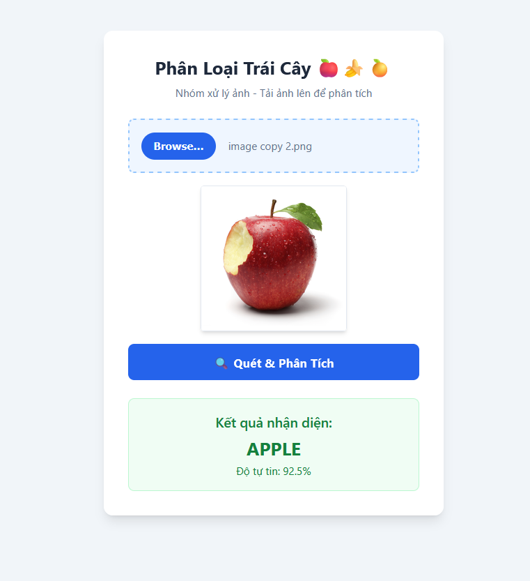

<div align="center">
  <h1>HỆ THỐNG PHÂN LOẠI TRÁI CÂY 🍎🍌🍊</h1>
  <h3>Website tích hợp mô hình phân loại trái cây</h3>
  <p align="center">
    
    
    <br>
    
    
  </p>
   
  <h4>
    <a href="#overview">Tổng Quát</a> ◆︎
    <a href="#demo">Demo</a> ◆︎
    <a href="#features">Tính Năng</a> ◆︎
    <a href="#prerequisites">Tiên Quyết</a> ◆︎
    <a href="#installation">Sử Dụng</a>
  </h4>
</div>

## Tổng Quát 📝
Một **Website** tích hợp với mô hình học máy **Phân loại trái cây** sử dụng ngôn ngữ **Python** tích hợp mô-đun **FastAPI**.  
Hiện tại **mô hình** chỉ mới phân loại được **Táo 🍎**, **Chuối 🍌** và **Cam 🍊** dựa trên ảnh đính kèm và hiển thị phần trăm tin cậy (%). Chưa hỗ trợ các loại trái cây khác.

## Demo 👀


## Tính Năng 🚀
<p>✅ Giao diện thân thiện: Người dùng dễ dàng sử dụng và thao tác trên trang web một cách đơn giản. </p>
<p>✅ Hỗ trợ tích hợp: Tích hợp mô hình học máy Python sử dụng mô-đun FastAPI. </p>

## Tiên Quyết 📥 
Để sử dụng mô hình hay kích hoạt liveserver cho trang web, bạn cần phải tải một số thứ cần thiết:

*   **[Git](https://git-scm.com)**: Version control system required to clone the repository to your computer.
*   **[VS Code](https://visualstudio.com)**: The recommended text editor for modern web development.
*   **[Live Server Extension](https://visualstudio.com)**: A VS Code extension to preview your portfolio live with hot-reload support.
*   **[Font Awesome](https://fontawesome.com)**: Essential web toolkit for icons 

## Sử Dụng 📦
1. Clone repository về máy cục bộ (hoặc thông qua VS Code IDE):
```bash
git clone https://github.com/Trankhoa0912/Fruit_classification.git
```

2. Di chuyển đến thư mục **src**:
```bash
cd ./src
```

3. Chạy **uvicorn**, để chạy framework **FastAPI** thay vì **Live Server** (port 8000 để hỗ trợ request **POST** so với 5500 của LS):
```bash
uvicorn main:app --reload
```

4. Mở trình duyệt với cục bộ:
```bash
http://localhost:8000
```